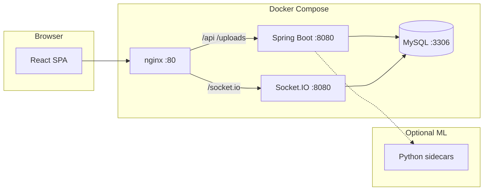

# ResQ Meal


**ResQ Meal** connects restaurants with surplus food to NGOs and volunteers — reducing waste, fighting hunger, and tracking real-world impact.

## Features

- **One-click surplus posting** — Restaurants list excess food in seconds
- **Smart matching** — Location, capacity, and demand-aware NGO pairing
- **Food safety** — Safety windows, temperature guidance, and freshness scoring
- **Live impact** — Meals saved, CO₂ avoided, and delivery metrics
- **Real-time updates** — Socket.IO notifications for matches and deliveries
- **Multilingual UI** — English, Tamil, and Hindi with dark mode
- **Security monitoring** — Rate limits, JWT auth, optional ML traffic analysis

## Quick Start (Docker Compose)

**Prerequisites:** Docker and Docker Compose

```bash
cp .env.docker.example .env.docker
# Edit .env.docker — set MYSQL_ROOT_PASSWORD and JWT_SECRET

docker compose up -d --build
```

| Service | URL |
|---------|-----|
| Web app | http://localhost |
| API (direct) | http://localhost:8080/api/health |
| Socket.IO | ws://localhost:8080/socket.io |
| MySQL (host) | `localhost:3307` |

The frontend nginx container proxies `/api`, `/uploads`, and `/socket.io` to the backend.

For step-by-step local dev (host MySQL, `.env`, admin setup): **[docs/CONNECT.md](docs/CONNECT.md)**

## Architecture



| Layer | Stack |
|-------|-------|
| Frontend | React 18, TypeScript, Vite, Tailwind, shadcn/ui |
| Backend | Java 17, Spring Boot 3, JDBC, Spring Security + JWT |
| Real-time | netty-socketio (same port as API, path `/socket.io`) |
| Database | MySQL 8 (`database/`) |
| ML (optional) | Python services in `ml/` |

## Development (without Docker)

```bash
npm install
cp backend/.env.example backend/.env   # configure DB + JWT
npm run dev:fullstack                  # MySQL init + API + Vite
```

Open **http://localhost:5173** — Vite proxies `/api` and `/socket.io` to Spring Boot.

Other commands:

```bash
npm run dev:all          # API + frontend only
npm run build:fullstack  # JAR with embedded static assets
npm run lint             # Frontend ESLint
npm run seed:info        # Print dev seed account hints (local only)
```

## Project structure

```
├── frontend/     React + Vite SPA
├── backend/      Spring Boot API + Socket.IO
├── database/     Schema, seed, migrations
├── ml/           Optional Python ML services
├── docs/         Setup, env vars, architecture notes
├── .github/      CI and deploy workflows
└── docker-compose.yml
```

## Environment

Full variable reference: **[docs/ENV_VARS.md](docs/ENV_VARS.md)**

- Backend: `backend/.env.example`
- Frontend: `frontend/.env.example`
- Docker: `.env.docker.example`

## Documentation

- [CONNECT.md](docs/CONNECT.md) — Local wiring and admin access
- [ENV_VARS.md](docs/ENV_VARS.md) — All environment variables
- [HTTPS_SETUP.md](docs/HTTPS_SETUP.md) — TLS for production
- [AI_IMPLEMENTATION.md](docs/AI_IMPLEMENTATION.md) — AI features overview

## Contributing

See [CONTRIBUTING.md](CONTRIBUTING.md).

## License

MIT
